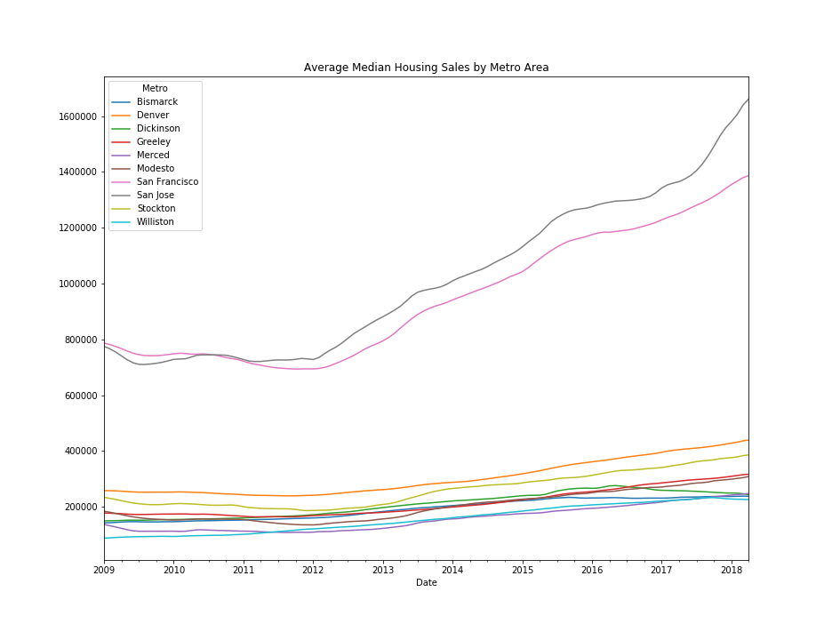
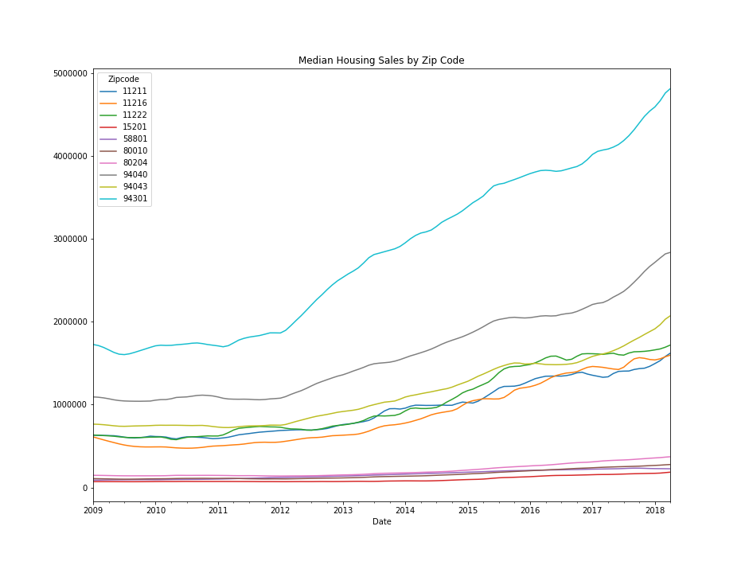
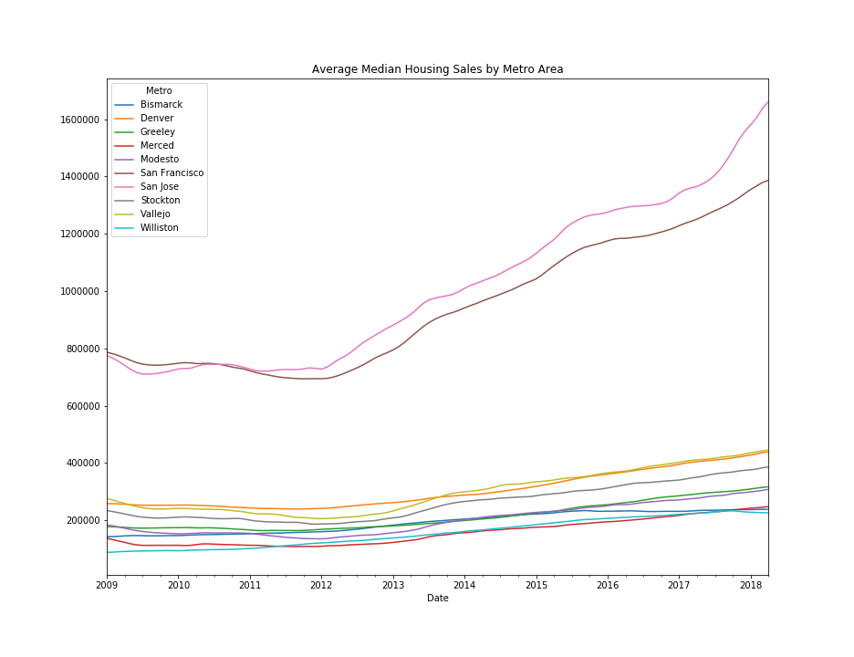
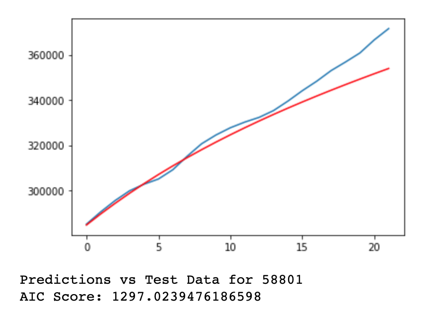
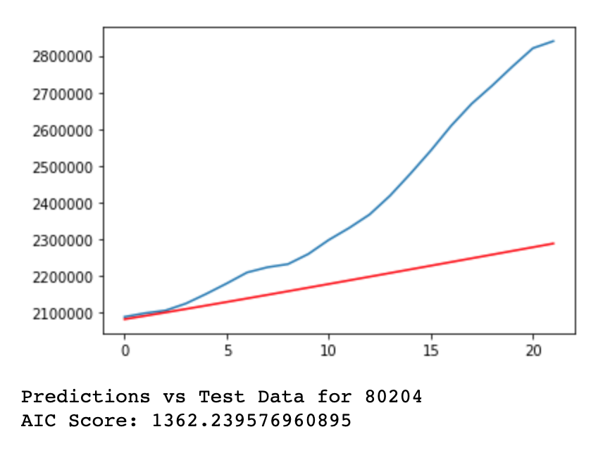
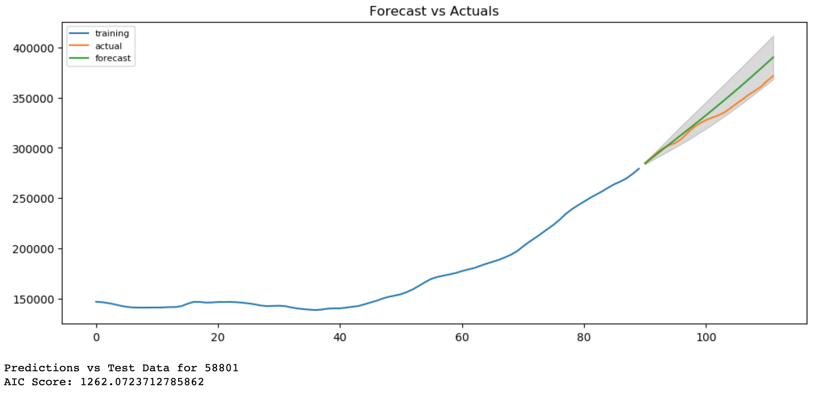
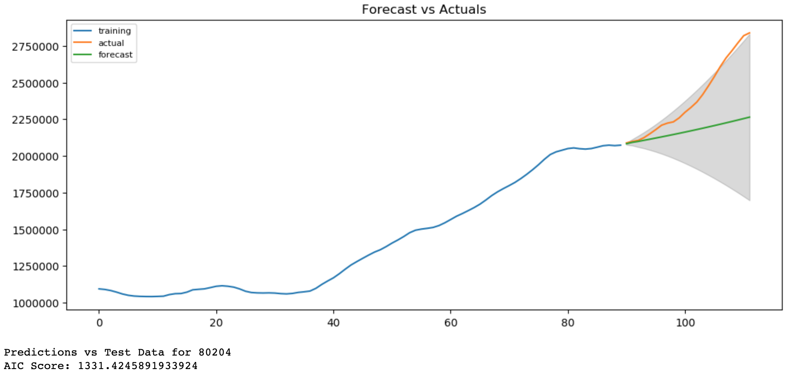

# Zillow Zipcode Analysis

## Introduction

This is the process by which I generated an AutoRegressive Integrated Moving Average (ARIMA) time series model to determine the best zipcodes for investment. The model was generated using historical median house sales from Zillow.

The data contains monthly median housing sales for zipcodes across the entire United States, going back as far as 1996.

What follows are my steps that lead me to my final model.

## Data Processing

### Removing Excess Data
I chose to limit my analysis to median housing sales that occured in 2009 and onward. Since the housing market crash caused prices around the country to drop, I figured it was best to start once prices had hit their low and were back on the rise.

### Removing Incomplete Data
Having removed all data prior to January 2009, I then checked to make sure all zipcodes had a complete set of data (112 data points, equally the number of months between January 2009 and April 2018) and removing those that didn't.

### Exploring Data
With my dataset cleaned, I explored trends in profit margin and return on investment (ROI). These metrics were calculated as follows:

**Profit Margin** = 1 - (*price paid for house*) / (*price house sold*)

**ROI** = (*price house sold* - *price paid for house*) / *price paid for house*

#### Profit Margin
Over the course of 9 years, the average profit margin per metro area was 13.36%.

#### Net Profit
Over the course of 9 years, the average return on investment per metro area was 18.4%.

## Modeling

After creating new variables and exploring the trends, it was time to put together my first round of time series modeling. I want to stress the importance of exploring the data before creating the model here, because when we create these time series models, we are doing it for each zip code. The dataset we started with had over 14,000 different zip codes, and it would take an enourmous amount of time to generate a model for each one, let alone tuning the parameters. 

#### Round 1
Having determined which zip codes to model from the results of my exploration, I created a function that generated a model and visualized predictions against test data for each zipcode. Using the standard parameters (1,1,1), I created my first round of ARIMA models.

Some predictions seemed to match the test data pretty well:

Others did not:

#### Round 2
With this in mind, I needed to re-run the ARIMA models, this time creating multiple models for each zip code. For this second round of modeling, I was looking to see which iteration of paramters *p*, *d*, and *q* would result in the lowest Akaike Information Criteria (AIC) score. The AIC score quanitifies the goodness of fit for a model, and by minimizing the AIC score for each zip code, you end up generating a model with the best for each zip code. Even with optimzing the parameters for each zip code, some models still didn't do as great a job as others.

This model fit the data rather well:

While this one still missed the mark:

#### Round 3
For the final round of modeling, I model each zipcode with the best parameters on the full dataset. For the first rounds of data, I split the data into training and testing data, which I did not do for the final round. It was these final models that I used to forecast median housing sales for each zip code and eventually come up with my recommended zip codes for investment.

## Summary

The median housing sales by zip code dataset provided by Zillow is a little too simple to provide robust predictions on future housing sales. There are a lot of factors to consider when investing in real estate:

1. **Resale value**, which can be affected by:
    - proximity to amenities like grocery stores, transit lines, entertainment venues, etc.
    - economic growth within the community; are there a lot of available jobs
    - status of local schools and other opportunities for education

    
2. **Risk**, which is measured by:
    - increasing vacancies
    - declining rents
    - economic downturn
    
And with these factors come other considerations. How long do you plan to own the property? Do you plan to fix up the house and resell? Or do you plan to just buy and hold the property for a longer timeframe, selling it once the price has increased a substantial amount?

With all these things in mind, you can see why this particular dataset is a little too simple for predicting solid investments. What with only providing the historical median housing sales by zip code, it's hard to calculate things like risk or account for factors that might affect resale value, like economic growth and proximity to amenities.

However, we can still come to some reasonable, albeit simplified, recommendations for real estate investements. 

#### Top Five Zip Codes for Investment
Although our data exploration looked at two different variables, return on investment (ROI) and profit margin, they both lead to the same top zip codes. The top 10 zip codes with the highest ROIs were the same zip codes with the largest profit margins. This makes sense, as we're only dealing with two separate values, how much the property was purchased for and for how much it was sold. Were we to have access to other variables like annual property tax, inflation, realtor fees, and any other costs that might be associated with buying and selling property, the two lists might have looked a little different. With this in mind, we should consider the following as **gross** ROIs, and not **net**, as they certainly don't account for all the cost associated with these transactions.

When considering ROIs, I recommend the following zip codes for investment opportunities.

**One Year**

1. **94043** - Mountain View, CA - 17.3% ROI
2. **15201** - Pittsburgh, PA - 16.8% ROI
3. **80204** - Denver, CO - 16.0% ROI 
4. **80010** - Aurora, CO - 14.8% ROI
5. **11222** - New York City, NY - 14.4% ROI

**Three Years**

2. **15201** - Pittsburgh, PA - 58.4% ROI
1. **94043** - Mountain View, CA - 57.7% ROI
3. **80204** - Denver, CO - 56.0% ROI 
4. **80010** - Aurora, CO - 52.7% ROI
5. **11222** - New York City, NY - 48.4% ROI

I think it's best to base investment decisions off the one-year predictions, as the model will have more uncertainty the farther out you forecast.

#### Future Analyses

By pairing the Zillow dataset with other datasets, like Census data, economic growth, and other housing datasets that include additional data related to risk, profitability, and proximity, you'd be able to create a much more robust model and be able to recommend better potential targets for investment.
